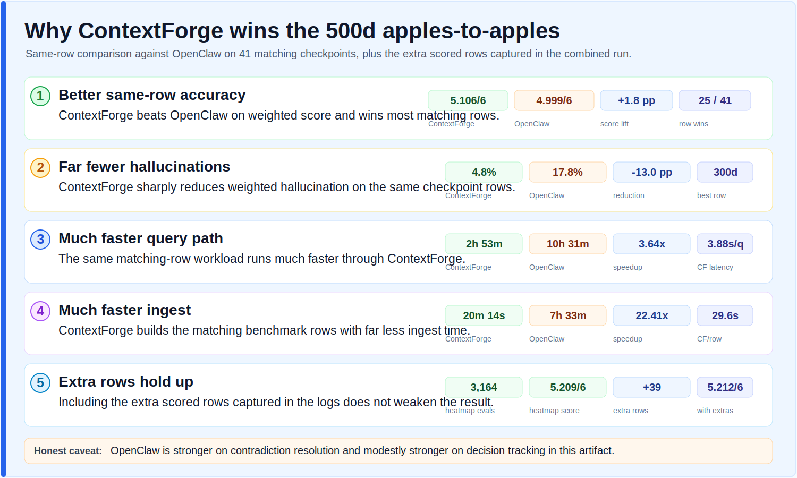

# 500d Apples-to-Apples Brief: ContextForge vs OpenClaw

This is the short version for teams that want the direct comparison without reading every benchmark row.

## Why ContextForge Wins

- **Better same-row accuracy.** On the 41 checkpoint rows where both systems have results, ContextForge scores **5.106/6 (85.1%)** vs OpenClaw at **4.999/6 (83.3%)**, a **+0.107/6 (+1.8 pp)** lift. ContextForge wins **25 of 41** matching rows.
- **Far fewer hallucinations.** Weighted hallucination drops from **17.8%** on OpenClaw to **4.8%** on ContextForge, a **-13.0 pp** reduction. The biggest row-level hallucination advantage is at **300d**: **1.7% vs 27.1%**.
- **Much faster retrieval/query path.** ContextForge completes the matching-row query workload in **2h 53m** vs OpenClaw at **10h 31m**, with weighted per-question query latency of **3.88s/q vs 14.14s/q**. That is **3.64x faster**.
- **Much faster ingest.** ContextForge ingests the same matching-row workload in **20m 14s** vs OpenClaw at **7h 33m**. Average ingest per row is **29.6s vs 11m 04s**, or **22.41x faster**.
- **Extra captured rows do not weaken the result.** The published heatmap has **3,164** evaluations at **5.209/6 (86.8%)**. Including the **39** extra scored rows captured in the raw question logs gives **3,203** rows at **5.212/6 (86.9%)**.

## Category-Level Readout

ContextForge leads OpenClaw in **6 of 8** scored categories on the matching rows.

| Category | ContextForge | OpenClaw | Delta |
|---|---:|---:|---:|
| Temporal reasoning | 4.886 | 3.752 | +1.133 |
| Negative recall | 5.716 | 5.181 | +0.535 |
| Factual recall | 5.321 | 5.128 | +0.193 |
| Cross-reference | 4.937 | 4.816 | +0.121 |
| Synthesis | 4.993 | 4.936 | +0.057 |
| Recency bias resistance | 4.825 | 4.800 | +0.025 |
| Decision tracking | 4.729 | 4.909 | -0.180 |
| Contradiction resolution | 4.487 | 5.421 | -0.934 |

## Honest Caveat

OpenClaw is stronger on **contradiction resolution** and modestly stronger on **decision tracking** in this artifact. The overall result still favors ContextForge because it wins most rows, has much lower hallucination, and is materially faster on both query and ingest.

## Source Artifacts

- [HEATMAP_AGGREGATE_500D.md](HEATMAP_AGGREGATE_500D.md)
- [OPENCLAW_COMPARISON_TABLE.md](OPENCLAW_COMPARISON_TABLE.md)
- [RESULTS_TABLE.md](RESULTS_TABLE.md)
