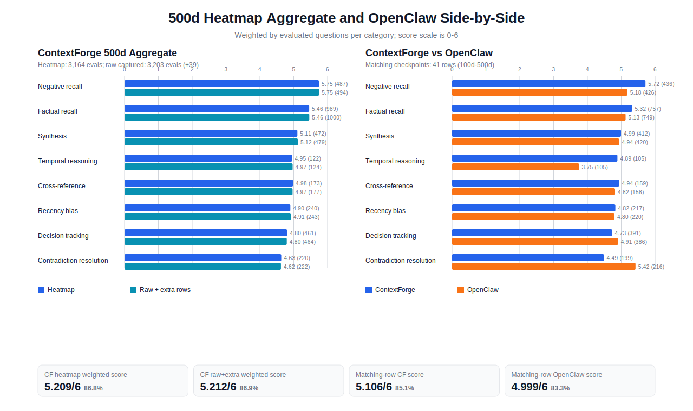

# 500d Heatmap Aggregate Chart

This report aggregates the category-level heatmap results for the 500d combined ContextForge run and compares the matching checkpoint rows against OpenClaw.

## Aggregate Summary

| Metric | Value |
|---|---:|
| ContextForge heatmap evaluations | 3,164 |
| ContextForge raw captured scored rows | 3,203 |
| Extra raw scored rows captured outside heatmap metadata | 39 |
| ContextForge heatmap weighted score | 5.209/6 (86.8%) |
| ContextForge raw+extra weighted score | 5.212/6 (86.9%) |
| OpenClaw matching checkpoint rows | 41 |
| Matching-row ContextForge weighted score | 5.106/6 (85.1%) |
| Matching-row OpenClaw weighted score | 4.999/6 (83.3%) |
| Matching-row score delta | +0.107/6 (+1.8pp) |

## Category Detail

| Category | CF heatmap | Qs | CF raw+extra | Qs | Raw delta | CF matching | OpenClaw matching | Delta |
|---|---:|---:|---:|---:|---:|---:|---:|---:|
| Negative recall | 5.745 | 487 | 5.749 | 494 | +0.004 | 5.716 | 5.181 | +0.535 |
| Factual recall | 5.457 | 989 | 5.461 | 1,000 | +0.004 | 5.321 | 5.128 | +0.193 |
| Synthesis | 5.108 | 472 | 5.121 | 479 | +0.013 | 4.993 | 4.936 | +0.057 |
| Temporal reasoning | 4.951 | 122 | 4.968 | 124 | +0.017 | 4.886 | 3.752 | +1.133 |
| Cross-reference | 4.977 | 173 | 4.966 | 177 | -0.011 | 4.937 | 4.816 | +0.121 |
| Recency bias | 4.900 | 240 | 4.914 | 243 | +0.014 | 4.825 | 4.800 | +0.025 |
| Decision tracking | 4.803 | 461 | 4.795 | 464 | -0.007 | 4.729 | 4.909 | -0.180 |
| Contradiction resolution | 4.632 | 220 | 4.622 | 222 | -0.010 | 4.487 | 5.421 | -0.934 |

Notes: heatmap and OpenClaw aggregates are weighted by `questionCount` in each checkpoint category score. The raw+extra ContextForge aggregate is computed from `questions-original.jsonl` plus `questions-continuation.jsonl`, which contain 3,203 scored rows compared with 3,164 heatmap evaluations in `result-continuation-report.json`.
