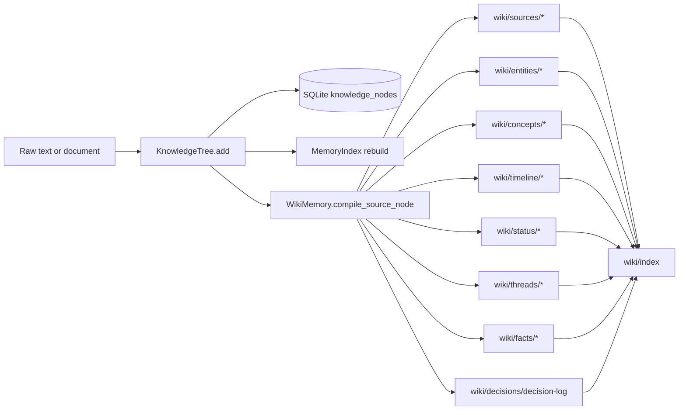
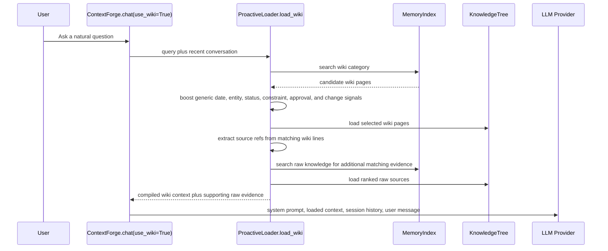
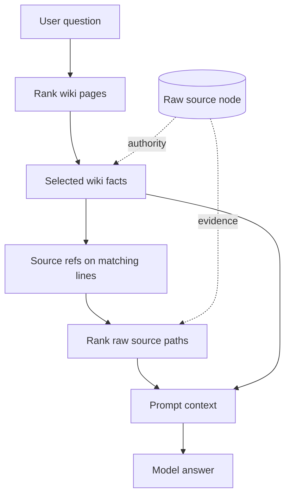

# Wiki Memory Implementation

ContextForge's wiki memory is a compiled, source-backed memory layer over the existing SQLite knowledge tree: raw ingested documents remain the authority, while `WikiMemory` creates smaller attributed pages that organize the same evidence by source, entity, concept, timeline, status, thread, decisions, constraints, approvals, exceptions, negative facts, and change history. At query time, `ProactiveLoader.load_wiki()` retrieves the most relevant wiki pages first, follows their source references back to raw evidence, ranks both layers against the user's actual question, and assembles a bounded prompt section that gives the model a structured map plus the underlying source text needed for grounding.

## Design Goals

- Preserve provenance: every compiled fact points back to a raw source path.
- Keep raw memory authoritative: wiki pages are derived indexes, not a replacement for source data.
- Improve long-horizon recall: temporal, status, decision, and change pages make later questions easier to route.
- Avoid benchmark-shaped shortcuts: retrieval uses generic entity, date, status, constraint, approval, and change signals rather than private answer keys.
- Stay local and simple: the wiki is stored in the same SQLite-backed `KnowledgeTree` and indexed by the existing in-memory `MemoryIndex`.

## Ingestion And Compilation

The public API has two paths into the wiki layer. `ingest_wiki_text()` stores the raw source and immediately compiles it, while `ingest_text(..., compile_wiki=True)` takes the same route from the general ingestion method. `compile_wiki(prefix)` can also compile existing non-wiki nodes in bulk. Compilation updates the index and invalidates loader cache so the next query sees the new pages.

Each compilation pass creates or updates several page families:

| Page family | Purpose |
|-------------|---------|
| `wiki/sources/*` | Compact source summaries with category, key concepts, entities, dates, and days. |
| `wiki/entities/*` | Facts grouped around named entities found in the source. |
| `wiki/concepts/*` | Keyword-derived topic pages for broad semantic routing. |
| `wiki/timeline/*` | Date or day anchored snapshots. |
| `wiki/status/*` | Status registers for approved, blocked, cancelled, deferred, rejected, and superseded states. |
| `wiki/threads/*` | Lightweight cross-cutting topic threads derived from entities and concepts. |
| `wiki/decisions/decision-log` | Durable decision and outcome facts. |
| `wiki/facts/negative-facts` | Cancellations, denials, unavailable items, and other negative recall facts. |
| `wiki/facts/constraints` | Gating items, dependencies, permissions, prerequisites, and blockers. |
| `wiki/facts/approvals-and-exceptions` | Approval, exception, disclosure, and sharing facts. |
| `wiki/facts/change-log` | Change-over-time facts with temporal labels. |
| `wiki/facts/temporal-state` | Generic time plus status facts used for current-state and historical questions. |

## Retrieval Flow

The loader spends context budget in stages. It first tries a smaller effective ceiling, then expands through 50%, 75%, and 100% of the configured maximum only when the current wiki context looks insufficient. Inside each stage, part of the budget goes to compiled wiki pages and the remainder goes to supporting raw evidence. This keeps short answers fast, while still allowing harder long-horizon questions to pull more context.

## Source-Backed Grounding

The important detail is that the wiki page is a routing and compression layer. It tells the loader which evidence is likely relevant, but the raw source node remains available to the prompt. This is why wiki pages include plain source references such as `Source: memory/day-72` or fact lines ending with `(Source: memory/day-72)`. The retrieval code extracts those paths, prefers references from wiki lines that match the question, then ranks raw sources again by question terms, dates, and entities.

## Reorganization And Latency

Wiki reorganization is ingestion-time work, not a model-time background process. A compile pass writes derived pages back into the same SQLite tree, merges new facts into stable page paths, rebuilds `wiki/index`, appends `wiki/log`, rebuilds `MemoryIndex`, and invalidates the loader cache. The cost is mostly deterministic local CPU and SQLite I/O: sentence scanning, regex extraction, keyword extraction, page upserts, chunking, and index rebuild. There is no LLM call in the current compiler, so latency scales with the number and size of sources compiled rather than model latency.

For single-source ingestion, reorganization is local and immediate: only the source's derived pages plus shared registers are touched. For bulk `compile_wiki(prefix)`, the same process repeats source by source and the cumulative cost scales with the matched non-wiki nodes. Query latency is affected by the number of indexed wiki pages and raw candidates, but the loader bounds prompt assembly through token budgets and staged retrieval. In practice, the design trades a small amount of ingestion-time reorganization for better query-time routing and less stale broad-context loading.

## Fairness Notes

The implementation is intentionally generic. It does not encode benchmark answer keys, private categories, or direct query-time day lookup as a shortcut. Temporal anchors can be stored as metadata during ingestion, and the wiki can expose date or day facts, but query-time retrieval still goes through the same source-backed wiki and raw-evidence ranking used for normal user questions.

## Operational Checks

`lint_wiki()` provides lightweight consistency checks over the compiled wiki. It flags missing `wiki/index`, pages without source references, large pages that may hurt targeted retrieval, broken wiki links, and orphan pages. These checks are useful after bulk ingestion or after changing compiler rules because they catch drift between the compiled layer and the raw source graph.
